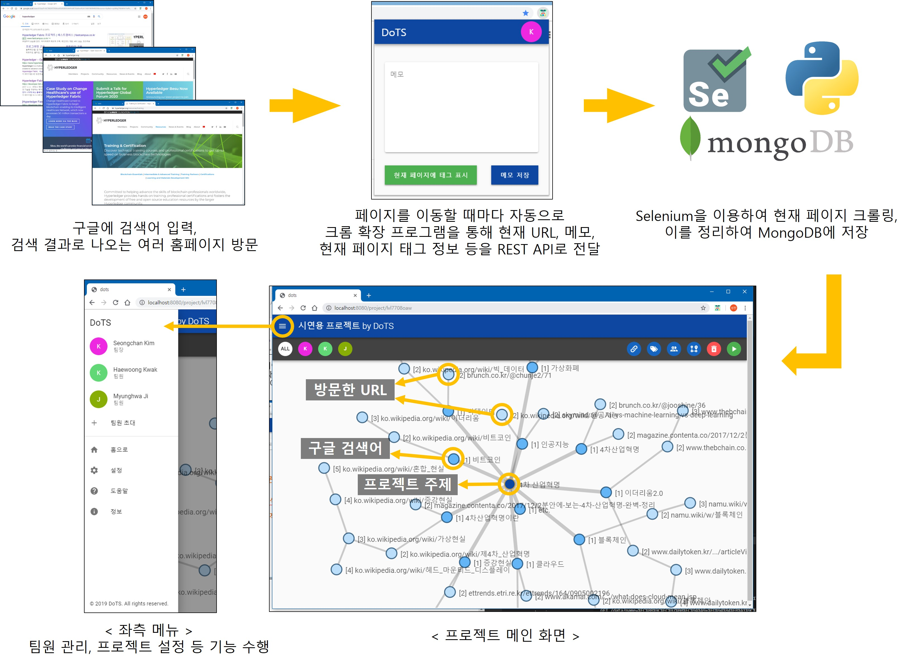
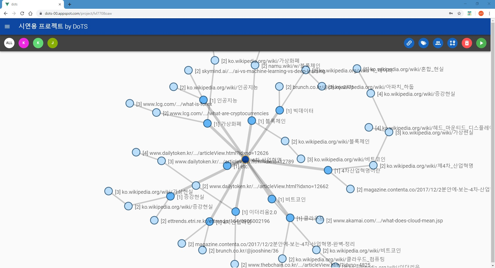
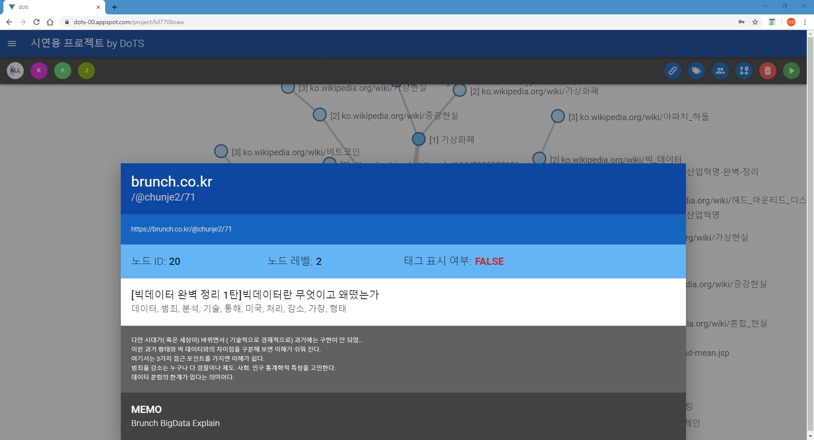
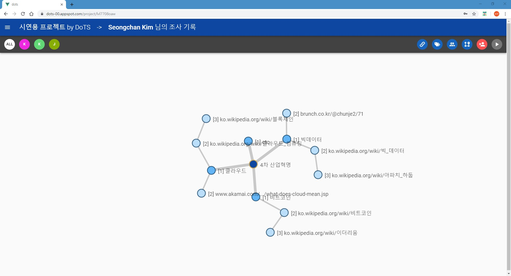
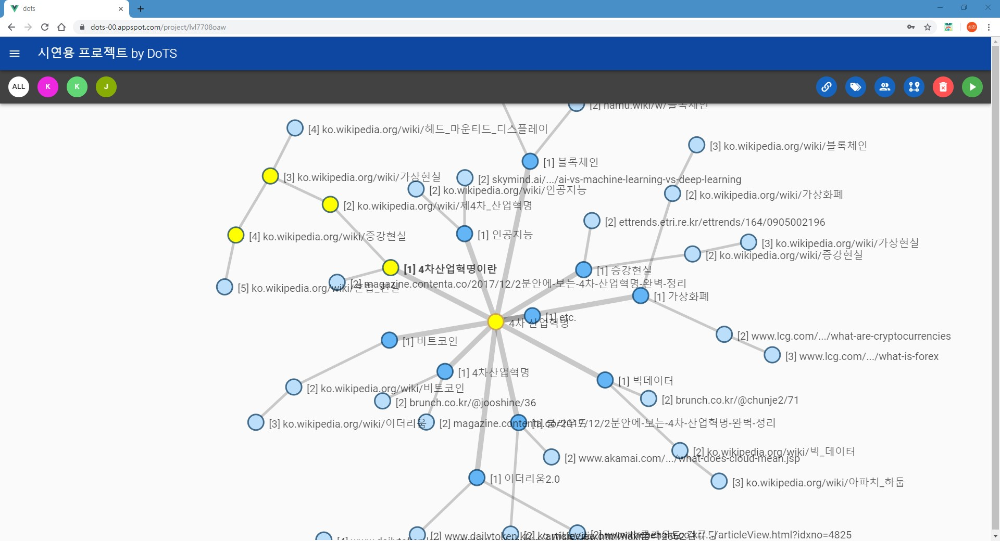
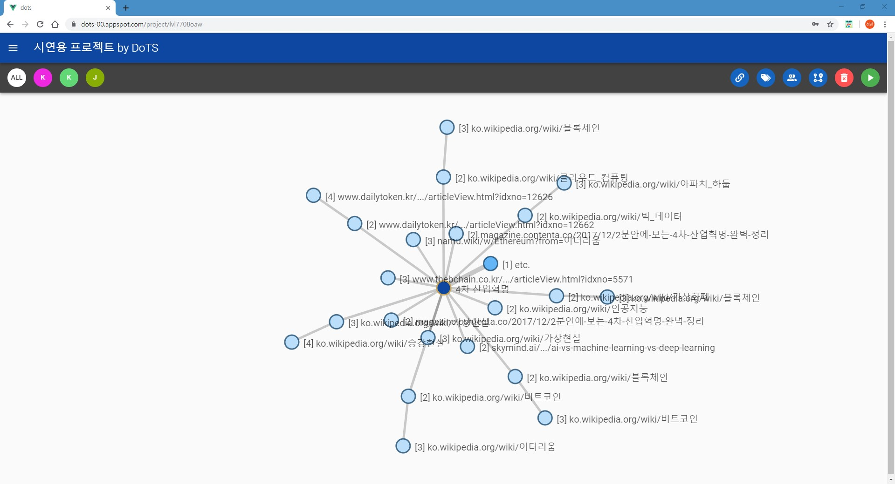
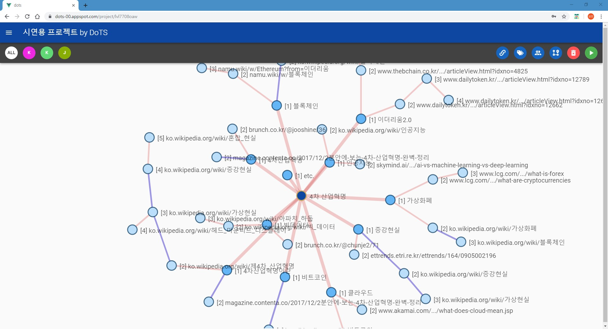
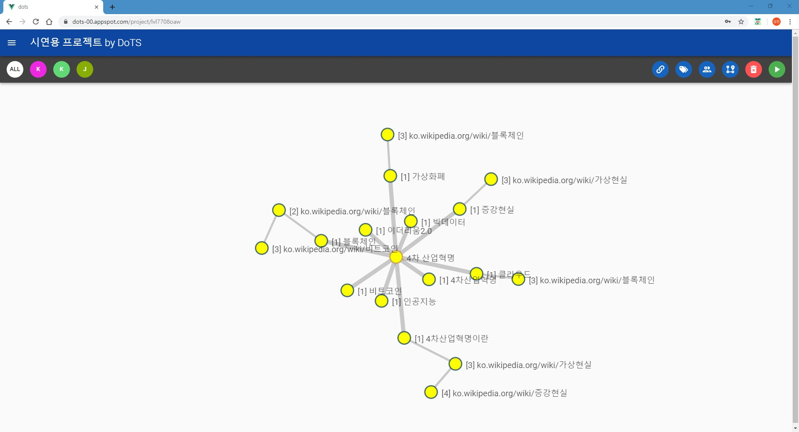

DoTS
====
  
## DoTS: Digitalization of Thinking Strategy
DoTS는 프로젝트를 위한 자동 자료 수집 및 분석 기능을 제공하는 협업 툴입니다.  
개인이나 팀 단위로 프로젝트를 수행할 때 자료를 수집하는 경우 사용자가 인터넷에서 찾은 자료를 일일이 기록할 필요 없이 자동으로 웹 사이트를 '크롤링'함으로써 조사한 웹 사이트들의 다양한 정보(출처, 해당 웹 페이지로부터 추출한 핵심 키워드 및 내용 등)를 기록해주고 이를 깔끔하게 '시각화'해주는 기능을 제공합니다.

현재 저장소에는 졸업작품 전시회 당시 시연했던 파일이 저장되어 있으며, 서비스에 대한 상세 설명은 추후에 업데이트할 예정입니다.

해당 서비스를 이용하기 위해서는 DoTS 크롬 확장 프로그램을 설치해야 합니다. (개발 중)  
https://github.com/sckroll/DoTS-Chrome

구성도
------


주요 기능
--------
### 1. 프로젝트 별 관리


### 2. 조사한 자료를 시각화 (현재 노드 형태로만 시각화 가능, 추후 시각화 종류 추가 예정)


### 3. 노드 클릭 시 해당 웹 페이지에 대한 상세 정보 출력 (출처 URL, 태그 표시 여부, 추출 키워드 등)


### 4. 팀원 별 조사 내용을 별도로 시각화


### 5. 특정 노드 Shift + 좌클릭 시 어느 키워드(노드)로부터 파생되었는지 경로 표시


### 6. 해당 웹 페이지(노드)에 대해 태그 표시한 노드만 표시 (미완성)


### 7. 다수 / 소수가 조사한 자료 구별 (파란색 간선 - 다수, 빨간색 간선 - 소수)


### 8. 위의 일부 기능을 취합하여 최적 노드 경로 도출 (추후에 노드 별 추출 키워드도 고려하여 최적 경로 도출 예정)



## Project setup
```
npm install
```

### Compiles and hot-reloads for development
```
npm run serve
```

### Compiles and minifies for production
```
npm run build
```

### Run your tests
```
npm run test
```

### Lints and fixes files
```
npm run lint
```

### Customize configuration
See [Configuration Reference](https://cli.vuejs.org/config/).
